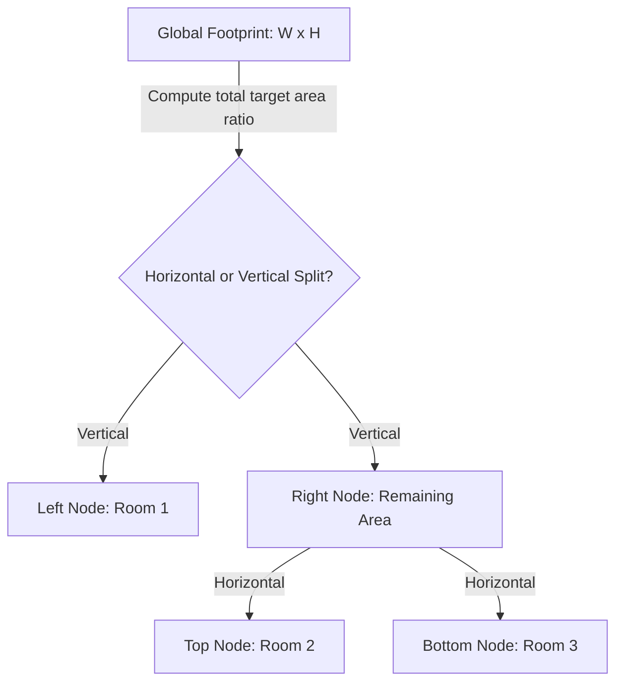

# Algorithmic & UI Interaction Specification

This document provides concrete implementations, mathematical coordinate mapping, rendering equations, and API payloads. Following these specifications ensures developers can build the core layout engine, coordinate editor, and image generator without guessing.

---

## 1. The Room Layout Solver (Procedural Algorithm)

To place rooms of varying target areas within a global boundary box (e.g., $10\text{m} \times 10\text{m}$ for $100\text{m}^2$) without overlaps, the backend should implement a **Recursive Binary Space Partitioning (BSP) / Slicing Tree** layout solver:



### The Slicing Tree Algorithm
1. **Sort Rooms:** Sort the rooms in descending order of their target area (larger spaces like living rooms are placed first).
2. **Global Footprint:** Start with a bounding box $(X_{start}, Y_{start}, W_{total}, H_{total})$.
3. **Partition Slicing:** For each room $i$ in the list:
   - Calculate the area ratio: $R_i = \text{TargetArea}_i / \text{RemainingArea}$.
   - Determine the split direction: Split along the longer axis of the current bounding box to maintain reasonable aspect ratios.
   - If splitting vertically:
     - $W_{room} = W_{current} \times R_i$
     - Room $i$ coordinates: $(X_{current}, Y_{current}, W_{room}, H_{current})$
     - Remaining footprint: $(X_{current} + W_{room}, Y_{current}, W_{current} - W_{room}, H_{current})$
   - If splitting horizontally:
     - $H_{room} = H_{current} \times R_i$
     - Room $i$ coordinates: $(X_{current}, Y_{current}, W_{current}, H_{room})$
     - Remaining footprint: $(X_{current}, Y_{current} + H_{room}, W_{current}, H_{current} - H_{room})$
4. **Post-Processing (Adjacency Adjustments):**
   - Run a collision check.
   - Generate walls: Represent walls as segment lines between shared coordinates.
   - Identify shared boundaries to place doors (e.g., check if a vertical segment of Room A overlaps with a vertical segment of Room B).

---

## 2. Canvas Mathematics: Meter-to-Pixel Coordinates

The React `<canvas>` editor must render the layout in real-world meters while translating coordinates to screen pixels dynamically to support zooming, panning, and grid snapping.

### Conversion Equations
Let $(x_m, y_m)$ be coordinates in meters, and $(x_p, y_p)$ be coordinates in pixels.
- Let `scale` be pixels-per-meter (e.g., $30\text{ px/m}$).
- Let `panX` and `panY` be screen-pixel offsets (supporting dragging the canvas view).

$$x_p = x_m \cdot \text{scale} + \text{panX}$$
$$y_p = y_m \cdot \text{scale} + \text{panY}$$

### Inverse Conversion (Click Detection & Dragging)
When a user clicks on screen pixel $(x_p, y_p)$, convert it back to meter coordinates to determine which room/wall was selected:

$$x_m = \frac{x_p - \text{panX}}{\text{scale}}$$
$$y_m = \frac{y_p - \text{panY}}{\text{scale}}$$

### Grid Snapping Formula
To keep walls aligned during manual canvas edits, snap coordinates to the nearest $0.1\text{m}$ ($10\text{cm}$) or $0.5\text{m}$ increment:

$$x_{snapped} = \text{round}\left(\frac{x_m}{\text{gridSize}}\right) \cdot \text{gridSize}$$

---

## 3. Stable Diffusion & ControlNet Generation Payload

To convert the 2D floor plan into a perspective visual concept rendering, the Image Service maps the floor plan into an intermediate SVG line drawing, then sends it to the Stable Diffusion API along with a **ControlNet** payload.

### ControlNet API Payload (`POST http://localhost:7860/sdapi/v1/txt2img`)
```json
{
  "prompt": "Modern Scandinavian apartment interior design, minimalist furniture, oak wood flooring, soft atmospheric lighting, highly detailed, photorealistic 8k architectural render",
  "negative_prompt": "blurry, lowres, distorted walls, bad proportions, worst quality, monochrome, drafts, text",
  "steps": 30,
  "cfg_scale": 7.0,
  "width": 768,
  "height": 512,
  "alwayson_scripts": {
    "ControlNet": {
      "args": [
        {
          "input_image": "BASE64_ENCODED_SVG_FLOORPLAN_LINE_ART",
          "module": "mlsd",
          "model": "control_v11p_sd15_mlsd [3a74a123]",
          "weight": 1.0,
          "guidance_start": 0.0,
          "guidance_end": 1.0,
          "control_mode": 1
        }
      ]
    }
  }
}
```
* **Preprocessor (`mlsd`):** Standard line-art detection optimized for straight-line architectural segments.
* **Control Mode (`1`):** Direct ControlNet to give high priority to the control image lines (forcing the generated image to strictly match the floor plan wall structure).

---

## 4. Complete Offline Mock Data Set

If developers are working without a GPU, local models, or internet access, the backend should serve this exact pre-baked schema. This allows testing the entire UI rendering, canvas editor, and chat interaction immediately.

### Mock Response (`GET /api/projects/mock-project-id/designs/1`)
```json
{
  "id": "mock-design-id",
  "project_id": "mock-project-id",
  "version": 1,
  "json_definition": {
    "buildingType": "apartment",
    "totalSurfaceArea": 90,
    "style": "scandinavian",
    "rooms": [
      {
        "id": "living_room",
        "type": "living_room",
        "targetArea": 35,
        "x": 0.0,
        "y": 0.0,
        "w": 7.0,
        "h": 5.0,
        "furniture": [
          { "id": "sofa_1", "name": "sofa", "x": 1.5, "y": 2.5, "width": 2.2, "length": 0.9 },
          { "id": "table_1", "name": "dining table", "x": 5.0, "y": 1.5, "width": 1.6, "length": 0.9 }
        ]
      },
      {
        "id": "bedroom_1",
        "type": "bedroom",
        "targetArea": 16,
        "x": 7.0,
        "y": 0.0,
        "w": 4.0,
        "h": 4.0,
        "furniture": [
          { "id": "bed_1", "name": "double bed", "x": 8.0, "y": 1.0, "width": 2.0, "length": 1.6 }
        ]
      },
      {
        "id": "kitchen_1",
        "type": "kitchen",
        "targetArea": 14,
        "x": 0.0,
        "y": 5.0,
        "w": 4.5,
        "h": 3.1,
        "furniture": [
          { "id": "counter_1", "name": "kitchen island", "x": 1.0, "y": 6.0, "width": 2.5, "length": 0.8 }
        ]
      },
      {
        "id": "bathroom_1",
        "type": "bathroom",
        "targetArea": 8,
        "x": 4.5,
        "y": 5.0,
        "w": 2.5,
        "h": 3.2,
        "furniture": [
          { "id": "tub_1", "name": "bathtub", "x": 4.8, "y": 5.5, "width": 1.7, "length": 0.7 }
        ]
      },
      {
        "id": "hallway_1",
        "type": "hallway",
        "targetArea": 17,
        "x": 7.0,
        "y": 4.0,
        "w": 4.0,
        "h": 4.2,
        "furniture": []
      }
    ]
  },
  "rendering_image_path": "/assets/mock-project-id/version_1_render.png",
  "floor_plan_image_path": "/assets/mock-project-id/version_1_layout.png",
  "created_at": "2026-06-22T21:40:00Z"
}
```
