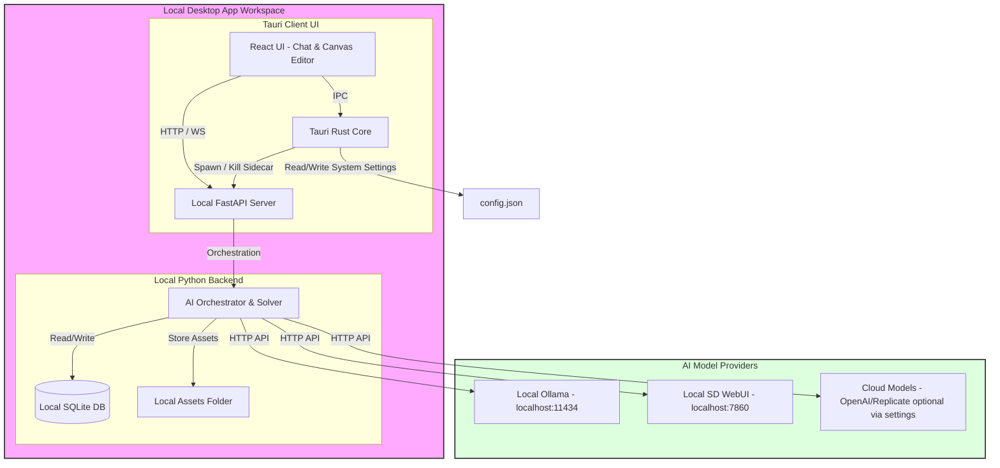
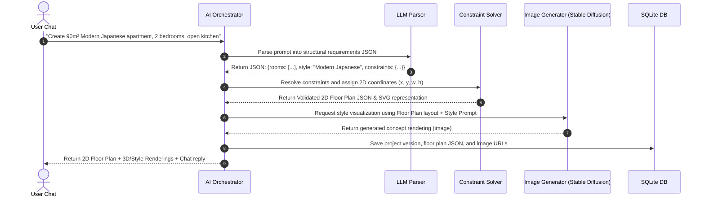

# Solution Architecture Documentation: AI Design Studio (CAIW)

This document details the Solution Architecture for the MVP of **AI Design Studio (CAIW)**, an AI-powered desktop application that helps users generate architectural layouts, room organizations, and furniture placements from natural language prompts.

---

## 1. High-Level Architecture (Local-First MVP)

To minimize deployment complexity, operational costs, and latency, the MVP targets a **fully local desktop application with no user credentials**. 



### Component Details
1. **Tauri Client (Frontend & Wrapper)**:
   - Built with **React 18**, **TypeScript**, and **CSS Modules (Vanilla CSS)** to achieve a premium custom design interface.
   - Embeds an **interactive 2D floor plan editor** using HTML5 Canvas or SVG.
   - Stores local system preferences (e.g. model endpoints, window state) in a local `config.json`.
2. **Local Python Backend (FastAPI)**:
   - Spawns automatically on application startup as a Tauri child process (sidecar).
   - Exposes REST and WebSocket endpoints for real-time generation updates and chat.
   - Manages data access to a local **SQLite** database and saves assets locally.
3. **AI Execution Layer**:
   - Integrates with local model runtimes (Ollama, Stable Diffusion WebUI) or routes to cloud APIs if the user adds API keys in the settings panel.

---

## 2. Component Design & Lifecycle

### Process Lifecycle Orchestration
When the user launches the application:
1. The Tauri Rust core starts up.
2. Tauri searches for a free port on `localhost` (starting at `8000`).
3. Tauri spawns the compiled FastAPI backend (sidecar) passing the chosen port, database path, and asset path as command line arguments.
4. The React frontend displays a loading spinner until it successfully establishes a handshake connection with the backend.
5. When the user exits the application, Tauri intercepts the close event, sends a termination signal to the FastAPI process, waits for it to exit, and then shuts down the client.

### Project Storage (SQLite Database)
All user projects, designs, and versions are stored locally. SQLite is lightweight, requires no server installation, and runs in-process.

```sql
-- Projects table
CREATE TABLE projects (
    id TEXT PRIMARY KEY, -- UUID
    name TEXT NOT NULL,
    original_prompt TEXT NOT NULL,
    created_at TIMESTAMP DEFAULT CURRENT_TIMESTAMP,
    updated_at TIMESTAMP DEFAULT CURRENT_TIMESTAMP
);

-- Designs table for project versions
CREATE TABLE designs (
    id TEXT PRIMARY KEY, -- UUID
    project_id TEXT NOT NULL,
    version INTEGER NOT NULL,
    json_definition TEXT NOT NULL, -- JSON-string of DesignSpecification
    rendering_image_path TEXT, -- Absolute local path to generated PNG
    floor_plan_image_path TEXT, -- Local path to generated 2D plan
    created_at TIMESTAMP DEFAULT CURRENT_TIMESTAMP,
    FOREIGN KEY(project_id) REFERENCES projects(id) ON DELETE CASCADE
);
```

---

## 3. The AI Generation Pipeline & Constraint Solver

A core technical challenge is ensuring generated layouts are realistic and satisfy architectural constraints. The system solves this with a **two-pass pipeline**:



### Step 1: LLM Parsing to Structured JSON Spec
The LLM converts conversational prompts into a strict JSON schema. If requirements are missing, the AI conversational assistant asks clarifying questions (e.g. preferred style, size, number of rooms) before executing.

Example intermediate schema output:
```json
{
  "buildingType": "apartment",
  "totalSurfaceArea": 90,
  "style": "scandinavian",
  "rooms": [
    { "id": "living_room", "type": "living_room", "targetArea": 35, "preferredConnections": ["kitchen", "hallway"] },
    { "id": "bedroom_1", "type": "bedroom", "targetArea": 16, "preferredConnections": ["bathroom_1", "hallway"] },
    { "id": "kitchen_1", "type": "kitchen", "targetArea": 14, "preferredConnections": ["living_room"] },
    { "id": "bathroom_1", "type": "bathroom", "targetArea": 8, "preferredConnections": ["bedroom_1", "hallway"] },
    { "id": "hallway_1", "type": "hallway", "targetArea": 17, "preferredConnections": [] }
  ]
}
```

### Step 2: Constraint Solver & Rule Engine
Instead of letting the LLM draw layouts directly (which leads to overlapping walls), a Python rule-engine:
1. **Extracts Adjacency & Area Constraints:** e.g., Bathroom must be adjacent to Bedroom.
2. **Generates Coordinates:** Runs a bounding-box packing algorithm to arrange room rectangles inside the global apartment footprint.
3. **Validates Layout Feasibility:**
   - Checks that all rooms are reachable.
   - Confirms rooms do not overlap.
   - Enforces min/max constraints (e.g. minimum bedroom area $\ge 12\text{m}^2$).

### Step 3: Visual Concept Generation
The generated 2D coordinate map is rendered into a clean layout image. This layout is fed into Stable Diffusion (using ControlNet or Image-to-Image inpainting) along with the chosen style prompts (e.g. *"Scandinavian minimal interior design, light oak wood floor, soft natural light, photorealistic rendering"*) to create the visual representations of the spaces.

---

## 4. Key Risks & Mitigations

| Risk | Impact | Mitigation Strategy |
| :--- | :--- | :--- |
| **Local GPU requirements for Stable Diffusion** | High | Provide a fallback setting. If the user doesn't have a high-end local GPU, they can easily toggle "Cloud Mode" and insert a Replicate or OpenAI API key. |
| **FastAPI Sidecar port collisions** | Medium | The Rust core dynamically probes ports, selecting the first available port (e.g., `8001`, `8002`) and passes it as a configuration parameter to FastAPI. |
| **Invalid/overlapping floor plans** | Medium | A rigorous Python test suite covering edge-case room requirements will validate the packing algorithm. If the solver fails, the system auto-retries with minor area adjustments. |
